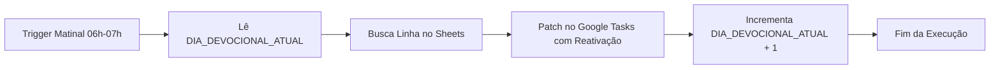

# 📖 Agendamento e Atualização Automática de Devocional Diário

[](https://developers.google.com/apps-script)
[](https://www.google.com/sheets/about/)
[](https://developers.google.com/tasks)
[](https://opensource.org/licenses/MIT)

Automação em nuvem de nível de produção desenvolvida em **Google Apps Script** (Engine V8) para atualizar e reativar diariamente, de forma 100% autônoma, uma tarefa recorrente no **Google Tarefas (Google Tasks)**.

Diferente de abordagens tradicionais que exibem apenas citações ou links externos, este pipeline injeta o **TEXTO BÍBLICO INTEGRAL formatado** diretamente nas anotações da tarefa. Isso viabiliza uma rotina devocional e de oração focada, sem necessidade de alternar entre aplicativos ou abrir Bíblias físicas/digitais.

---

## ⚡ Destaques de Engenharia e Resiliência (Produção)

Para garantir 100% de confiabilidade no disparo diário e evitar falhas comuns do Google Tasks em tarefas recorrentes, a automação conta com as seguintes melhorias críticas:

1. **Visibilidade Abrangente da Tasks API (`showCompleted: true` e `showHidden: true`):**
   - O Google Tasks frequentemente oculta ou marca instâncias recorrentes concluídas no dia anterior antes da geração da nova ocorrência.
   - A listagem com esses parâmetros garante que instâncias geradas pela recorrência ou tarefas arquivadas/concluídas não sejam perdidas ou ignoradas durante a varredura.
2. **Reativação Automática de Instância (`status: "needsAction"` e `completed: null`):**
   - No momento do `patch`, o payload força o status da tarefa de volta para ativa (`needsAction`) e anula a data de conclusão (`completed: null`).
   - Isso garante que a tarefa retorne ao topo da lista com notificações visíveis e alarme funcional no dispositivo móvel às **08:30**.
3. **Varredura Multilista com Paginação (`nextPageToken`):**
   - O script não assume uma lista padrão: ele itera por todas as listas de tarefas da conta Google.
   - Suporta paginação completa através de `nextPageToken` e `maxResults: 100`, localizando a tarefa alvo independentemente da quantidade de itens existentes.
4. **Persistência de Estado Serverless (`PropertiesService`):**
   - Controle sequencial do dia corrente mantido via `ScriptProperties` (`DIA_DEVOCIONAL_ATUAL`), com suporte a reinício cíclico (1 a 90 dias) e funções utilitárias de calibração manual.

---

## 📌 Principais Recursos

- **📖 Texto Integral nas Anotações:** Injeta a leitura bíblica completa (NVI / ARA) estruturada por versículo com o marcador visual `💬`.
- **⏰ Execução em Piloto Automático:** Trigger diário baseado em tempo executado entre **06:00 e 07:00** (antecedendo o alarme da tarefa às 08:30).
- **🔄 Ciclo Contínuo de 90 Dias:** Ao concluir o Dia 90, o ciclo reinicia de forma transparente no Dia 1.
- **🛠️ Sincronização e Ajuste Fino Manual:** Funções de alinhamento para casos de testes, feriados ou sincronização com dias específicos da semana.
- **🛡️ Zero Dependências Externas:** Utiliza apenas APIs nativas do ecossistema Google Workspace.

---

## 📁 Estrutura do Repositório

```text
Agendamento-Leitura-Biblica/
├── Cronograma_Versiculos_Com_Texto.csv  # Base canônica com referências e TEXTO INTEGRAL (90 dias)
├── Cronograma-Versiculos-Devocional.js    # Código-fonte da automação (Google Apps Script)
└── README.md                             # Documentação técnica e guia operacional
```

### 📋 Especificação do Dataset (`Cronograma_Versiculos_Com_Texto.csv`)

O arquivo CSV segue a norma **RFC 4180** (codificação UTF-8) e é estruturado em 5 colunas:

| Coluna | Tipo | Descrição | Exemplo |
| :--- | :--- | :--- | :--- |
| **`Dia_Numero`** | Inteiro | Número ordinal do dia (1 a 90) | `1` |
| **`Dia_Semana`** | Texto | Dia da semana correspondente | `Segunda` |
| **`Tema`** | Texto | Eixo temático do dia | `Recomeço` |
| **`Versiculos`** | Texto | Referências resumidas dos versículos | `2Co 5:17, Ez 36:26, Sl 51:10` |
| **`Texto_Completo`** | Texto | Textos integrais delimitados por ` \| ` | `2Co 5:17 - Portanto, se alguém... \| Ez 36:26 - Darei a vocês...` |

---

## ⚙️ Mecânica de Formatação do Texto Bíblico

A coluna `Texto_Completo` (índice 4 / Coluna E) armazena os versículos encadeados pelo delimitador `" | "`. 

O algoritmo processa a string convertendo cada passagem em um bloco devocional destacado:

```javascript
// Tratamento da coluna de texto completo (Coluna E / índice 4)
let textoBiblicoFormatado = "";
if (linhaEncontrada[4]) {
  const versiculosArray = linhaEncontrada[4].toString().split(" | ");
  textoBiblicoFormatado = "\n\n" + versiculosArray.map(v => `💬 ${v.trim()}`).join("\n\n");
}
```

---

## 🔄 Gestão do Contador Sequencial (`PropertiesService`)

A evolução do plano de leitura não depende de datas estáticas em planilha, mas sim do estado persistido no `PropertiesService` do Apps Script sob a chave `DIA_DEVOCIONAL_ATUAL`:



### Funções Utilitárias de Sincronização

| Função | Parâmetros | Finalidade Operacional |
| :--- | :--- | :--- |
| **`definirDiaManual(numero)`** | `numero` *(opcional, ex: `4`)* | Alinha imediatamente o contador com o dia do calendário desejado (ex: sincronizar com a Quinta-feira). Se chamado sem argumentos, define por padrão o **Dia 4**. |
| **`definirDiaInicial()`** | *Nenhum* | Reseta o contador para o **Dia 1** (início do ciclo de 90 dias). |

> [!TIP]
> Caso queira testar a automação sem esperar o dia seguinte ou pular leituras após um período de pausa, execute `definirDiaManual(X)` diretamente no editor do Apps Script.

---

## 🚀 Passo a Passo de Implantação

### 1. Criar a Tarefa Base no Google Tasks
No aplicativo **Google Tarefas** (web ou mobile):
- **Título:** `Leitura Bíblica Diária e Oração (10 min)` *(o script faz busca `includes` case-insensitive)*
- **Horário:** `08:30`
- **Recorrência:** Diária

### 2. Importar Dados no Google Sheets
1. Crie uma planilha no [Google Sheets](https://sheets.google.com).
2. Acesse **Arquivo** > **Importar** > **Fazer upload** e envie o arquivo [`Cronograma_Versiculos_Com_Texto.csv`](file:///C:/Users/arsx_/Documents/Agendamento-Leitura-Biblica/Cronograma_Versiculos_Com_Texto.csv).
3. Selecione a opção **Substituir planilha atual**.

### 3. Habilitar a Google Tasks API no Apps Script
1. Na planilha, acesse **Extensões** > **Apps Script**.
2. No menu lateral esquerdo, clique no botão **`+`** em **Serviços**.
3. Selecione **Google Tasks API**, mantenha o Identificador como `Tasks` e clique em **Adicionar**.

### 4. Publicar o Código
Copie o código de [`Cronograma-Versiculos-Devocional.js`](file:///C:/Users/arsx_/Documents/Agendamento-Leitura-Biblica/Cronograma-Versiculos-Devocional.js) para o editor do Apps Script e salve (`Ctrl + S`):

```javascript
function atualizarDevocionalDiario() {
  const nomeTarefa = "Leitura Bíblica Diária e Oração (10 min)";
  
  // 1. Obter a aba ativa da planilha
  const sheet = SpreadsheetApp.getActiveSpreadsheet().getActiveSheet();
  const dados = sheet.getDataRange().getValues();
  
  if (dados.length <= 1) {
    Logger.log("Aviso: Planilha vazia ou apenas com cabeçalho.");
    return;
  }

  // 2. Obter dia sequencial armazenado
  const props = PropertiesService.getScriptProperties();
  let diaAtual = parseInt(props.getProperty("DIA_DEVOCIONAL_ATUAL") || "1", 10);

  // 3. Localizar a linha do Dia_Numero
  let linhaEncontrada = null;
  for (let i = 1; i < dados.length; i++) {
    const diaLinha = parseInt(dados[i][0], 10);
    if (diaLinha === diaAtual) {
      linhaEncontrada = dados[i];
      break;
    }
  }

  // Fallback: reinicia caso o contador ultrapasse as linhas disponíveis
  if (!linhaEncontrada) {
    diaAtual = parseInt(dados[1][0], 10) || 1;
    linhaEncontrada = dados[1];
  }

  const diaNumero = linhaEncontrada[0];
  const diaSemana = linhaEncontrada[1];
  const tema = linhaEncontrada[2];
  const versiculosRef = linhaEncontrada[3];
  
  // 4. Trata a coluna de texto completo (Coluna E / índice 4)
  let textoBiblicoFormatado = "";
  if (linhaEncontrada[4]) {
    const versiculosArray = linhaEncontrada[4].toString().split(" | ");
    textoBiblicoFormatado = "\n\n" + versiculosArray.map(v => `💬 ${v.trim()}`).join("\n\n");
  }

  // 5. Montar a descrição final da tarefa
  const novaDescricao = 
    `• Tirar 10 minutos de reflexão, leitura e oração.\n` +
    `• Foco em: renovação de vida, disciplina, superação de hábitos antigos, honra à família e organização.\n\n` +
    `📖 Devocional de Hoje (Dia ${diaNumero} - ${diaSemana}):\n` +
    `Tema: ${tema}\n` +
    `Referências: ${versiculosRef}` +
    textoBiblicoFormatado;

  // 6. Atualizar a tarefa no Google Tasks
  const taskService = (typeof Tasks !== 'undefined') ? Tasks : GoogleTasks;
  const taskLists = taskService.Tasklists.list().items;
  
  if (!taskLists || taskLists.length === 0) {
    Logger.log("Nenhuma lista de tarefas encontrada.");
    return;
  }

  let tarefaAtualizada = false;
  const termoBusca = nomeTarefa.toLowerCase().trim();

  for (let list of taskLists) {
    let pageToken = null;

    do {
      // Busca tanto pendentes quanto concluídas (evita perder instâncias recorrentes)
      const response = taskService.Tasks.list(list.id, {
        showCompleted: true,
        showHidden: true,
        maxResults: 100,
        pageToken: pageToken
      });

      if (response.items && response.items.length > 0) {
        for (let task of response.items) {
          if (task.title && task.title.toLowerCase().includes(termoBusca)) {
            task.notes = novaDescricao;
            
            // Reativa a tarefa caso tenha ficado marcada como concluída
            task.status = "needsAction";
            task.completed = null;

            taskService.Tasks.patch(task, list.id, task.id);
            Logger.log(`[SUCESSO] Tarefa atualizada e reativada para o Dia ${diaNumero} (${diaSemana} - ${tema}) na lista "${list.title}"!`);
            tarefaAtualizada = true;
            break;
          }
        }
      }

      if (tarefaAtualizada) break;
      pageToken = response.nextPageToken;
    } while (pageToken);

    if (tarefaAtualizada) break;
  }

  if (!tarefaAtualizada) {
    Logger.log(`[AVISO] Nenhuma tarefa com o título contendo "${nomeTarefa}" foi encontrada.`);
    return;
  }

  // 7. Incrementa o dia para a próxima execução matinal
  props.setProperty("DIA_DEVOCIONAL_ATUAL", (diaAtual + 1).toString());
}

function definirDiaManual(numero) {
  const diaAlvo = numero ? numero.toString() : "4";
  PropertiesService.getScriptProperties().setProperty("DIA_DEVOCIONAL_ATUAL", diaAlvo);
  Logger.log(`[SINCRONIZAÇÃO] Contador ajustado com sucesso para o Dia ${diaAlvo}!`);
}

function definirDiaInicial() {
  PropertiesService.getScriptProperties().setProperty("DIA_DEVOCIONAL_ATUAL", "1");
  Logger.log("Contador reiniciado para o Dia 1.");
}
```

### 5. Configurar o Acionador Diário (Trigger)
1. No menu lateral do Apps Script, clique no ícone de relógio (**Acionadores**).
2. Clique em **+ Adicionar acionador** com as configurações:
   - **Função:** `atualizarDevocionalDiario`
   - **Origem do evento:** `Baseado no tempo`
   - **Tipo de acionador:** `Contador de dias`
   - **Hora do dia:** `06:00 às 07:00` (ou `07:00 às 08:00`)
3. Conceda as permissões OAuth solicitadas.

---

## 📱 Exemplo Visual nas Anotações do Google Tasks

```text
• Tirar 10 minutos de reflexão, leitura e oração.
• Foco em: renovação de vida, disciplina, superação de hábitos antigos, honra à família e organização.

📖 Devocional de Hoje (Dia 1 - Segunda):
Tema: Recomeço
Referências: 2Co 5:17, Ez 36:26, Sl 51:10

💬 2Co 5:17 - Portanto, se alguém está em Cristo, é nova criação. As coisas antigas já passaram; eis que surgiram coisas novas!

💬 Ez 36:26 - Darei a vocês um coração novo e porei um espírito novo em vocês; tirarei de vocês o coração de pedra e lhes darei um coração de carne.

💬 Sl 51:10 - Cria em mim um coração puro, ó Deus, e renova dentro de mim um espírito estável.
```

---

## 🔍 Guia Rápido de Solução de Problemas (Troubleshooting)

### ❓ "A tarefa não disparou / não atualizou o conteúdo hoje"

1. **Verifique o horário do Acionador:**
   - O acionador matinal deve rodar na janela entre **06:00 e 07:00** (ou até 08:00), garantindo que a tarefa seja atualizada e reativada antes do alarme das **08:30**.
2. **Status de Conclusão da Tarefa Anterior:**
   - Graças aos parâmetros `showCompleted: true`, `showHidden: true`, `status: "needsAction"` e `completed: null`, o script reativa tarefas concluídas. No entanto, se o título da tarefa no Google Tasks foi alterado manualmente, o script não a localizará. Verifique se o título contém exatamente `Leitura Bíblica Diária e Oração (10 min)`.
3. **Ajuste Manual do Dia:**
   - Se o script falhou por falta de permissão ou se você deseja forçar o dia correto imediatamente, abra o editor do Apps Script, selecione `definirDiaManual`, defina o parâmetro desejado (ex: `definirDiaManual(5)`) e execute a função. Em seguida, execute `atualizarDevocionalDiario` para aplicar o conteúdo na hora.
4. **Logs de Execução:**
   - Acesse **Execuções** no painel do Apps Script para auditar o log detalhado de cada execução (`[SUCESSO]`, `[AVISO]` ou mensagens de erro da API).

---

## 🛠️ Tecnologias e Padrões

* **Runtime:** [Google Apps Script](https://developers.google.com/apps-script) (V8 JavaScript Engine)
* **API de Produtividade:** [Google Tasks API v1](https://developers.google.com/tasks)
* **Persistência de Estado:** Google Apps Script `PropertiesService`
* **Formato de Dados:** CSV RFC 4180 (UTF-8)
