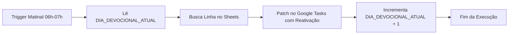

# 📖 Agendamento e Atualização Automática de Devocional Diário

[](https://developers.google.com/apps-script)
[](https://www.google.com/sheets/about/)
[](https://developers.google.com/tasks)
[](https://opensource.org/licenses/MIT)

Automação em nuvem de nível de produção desenvolvida em **Google Apps Script** (Engine V8) para atualizar e reativar diariamente, de forma 100% autônoma, uma tarefa recorrente no **Google Tarefas (Google Tasks)**.

Diferente de abordagens tradicionais que exibem apenas citações ou links externos, este pipeline injeta o **TEXTO BÍBLICO INTEGRAL formatado** diretamente nas anotações da tarefa. Isso viabiliza uma rotina devocional e de oração focada, sem necessidade de alternar entre aplicativos ou abrir Bíblias físicas/digitais.

---

### ⚡ Destaques de Engenharia e Resiliência (Produção)

Para garantir 100% de confiabilidade no disparo diário e mitigar idiossincrasias do Google Tasks, a arquitetura conta com os seguintes pilares de resiliência:

1. **Bootstrap e Auto-Criação com Alerta Imediato (`executarTesteImediatoAgora`):**
   - Caso a tarefa alvo não exista em nenhuma lista durante a execução de teste, ela é **criada automaticamente** na lista padrão (`@default`) com vencimento programado para **+2 minutos** (`now + 2 min`), permitindo validação rápida de notificações push no smartphone/desktop.
2. **Robustez de Busca e Normalização Unicode NFD (`normalizarTexto`):**
   - A busca e comparação de títulos e listas utilizam decomposição canônica Unicode NFD (`.normalize('NFD').replace(/[\u0300-\u036f]/g, '')`), tornando o pipeline imune a diferenças de acentuação, maiúsculas/minúsculas ou espaços extras inseridos por teclados móveis.
3. **Visibilidade Abrangente da Tasks API (`showCompleted: true` e `showHidden: true`):**
   - O Google Tasks frequentemente oculta instâncias concluídas no dia anterior antes da geração da nova ocorrência. A listagem abrangente garante que tarefas arquivadas ou concluídas não sejam ignoradas durante a varredura.
4. **Reativação Automática de Instância (`status: "needsAction"` e `completed: null`):**
   - No momento do `patch`, o payload força o status da tarefa de volta para ativa (`needsAction`) e anula a data de conclusão (`completed: null`), garantindo que a tarefa retorne ao topo da lista com alarmes e notificações funcionais.
5. **Varredura Multilista com Paginação Exaustiva (`nextPageToken`):**
   - O algoritmo itera dinamicamente por todas as listas de tarefas da conta Google (`Tasklists.list()`) com paginação completa (`maxResults: 100` e `nextPageToken`), localizando a tarefa independentemente do volume de itens armazenados.
6. **Sincronização Segura e Isolamento de Estado Serverless (`PropertiesService`):**
   - Execuções de teste (`executarTesteImediatoAgora` e `testarDiaEspecifico`) operam com **isolamento de estado** (`avancarContador: false`), impedindo que testes manuais consumam ou desalinhem a fila sequencial do cronograma oficial de produção mantido em `ScriptProperties` (`DIA_DEVOCIONAL_ATUAL`).

---

## 📌 Principais Recursos

- **📖 Texto Integral nas Anotações:** Injeta a leitura bíblica completa (NVI / ARA) estruturada por versículo com o marcador visual `💬`.
- **⏰ Execução em Piloto Automático:** Trigger diário baseado em tempo executado entre **06:00 e 07:00** (antecedendo o alarme da tarefa às 08:30).
- **🔄 Ciclo Contínuo de 90 Dias:** Ao concluir o Dia 90, o ciclo reinicia de forma transparente no Dia 1.
- **🛠️ Sincronização e Ajuste Fino Manual:** Funções de alinhamento para testes, feriados ou sincronização com dias específicos da semana.
- **🛡️ Zero Dependências Externas:** Utiliza apenas APIs nativas do ecossistema Google Workspace.

---

## 📁 Estrutura do Repositório

```text
Agendamento-Leitura-Biblica/
├── Cronograma_Versiculos_Com_Texto.csv  # Base canônica com referências e TEXTO INTEGRAL (90 dias)
├── Cronograma-Versiculos-Devocional.js    # Código-fonte da automação (Google Apps Script)
└── README.md                             # Documentação técnica e guia operacional
```

### 📋 Especificação do Dataset (`Cronograma_Versiculos_Com_Texto.csv`)

O arquivo CSV segue a norma **RFC 4180** (codificação UTF-8) e é estruturado em 5 colunas:

| Coluna | Tipo | Descrição | Exemplo |
| :--- | :--- | :--- | :--- |
| **`Dia_Numero`** | Inteiro | Número ordinal do dia (1 a 90) | `1` |
| **`Dia_Semana`** | Texto | Dia da semana correspondente | `Segunda` |
| **`Tema`** | Texto | Eixo temático do dia | `Recomeço` |
| **`Versiculos`** | Texto | Referências resumidas dos versículos | `2Co 5:17, Ez 36:26, Sl 51:10` |
| **`Texto_Completo`** | Texto | Textos integrais delimitados por ` \| ` | `2Co 5:17 - Portanto, se alguém... \| Ez 36:26 - Darei a vocês...` |

---

## ⚙️ Mecânica de Formatação do Texto Bíblico

A coluna `Texto_Completo` (índice 4 / Coluna E) armazena os versículos encadeados pelo delimitador `" | "`. 

O algoritmo processa a string convertendo cada passagem em um bloco devocional destacado:

```javascript
// Tratamento da coluna de texto completo (Coluna E / índice 4)
let textoBiblicoFormatado = "";
if (info.textoCompleto) {
  const versiculosArray = info.textoCompleto.split(" | ");
  textoBiblicoFormatado = "\n\n" + versiculosArray.map(v => `💬 ${v.trim()}`).join("\n\n");
}
```

---

## 🔄 Gestão do Contador Sequencial (`PropertiesService`)

A evolução do plano de leitura não depende de datas estáticas em planilha, mas sim do estado persistido no `PropertiesService` do Apps Script sob a chave `DIA_DEVOCIONAL_ATUAL`:



### Funções Utilitárias e Operacionais

| Função | Parâmetros | Finalidade Operacional |
| :--- | :--- | :--- |
| **`atualizarDevocionalDiario()`** | *Nenhum* | Função oficial de produção (acionador diário). Atualiza notas, reativa a tarefa e avança o contador sequencial. |
| **`executarTesteImediatoAgora()`** | *Nenhum* | Modo de teste imediato com auto-criação da tarefa para daqui a **+2 minutos** (se inexistente) e isolamento do contador (não avança o dia). |
| **`testarDiaEspecifico(numeroDia)`** | `numeroDia` *(ex: `4`)* | Injeta na tarefa os dados de um dia específico para conferência sem alterar o ponteiro do cronograma. |
| **`definirDiaManual(numero)`** | `numero` *(opcional, ex: `4`)* | Alinha manualmente o ponteiro do cronograma para o dia especificado (padrão: Dia 4). |
| **`definirDiaInicial()`** | *Nenhum* | Reinicia o ciclo sequencial para o **Dia 1**. |

> [!TIP]
> Para testar as notificações push no seu smartphone sem impactar o cronograma de produção, basta executar `executarTesteImediatoAgora()` no editor do Apps Script.

---

## 🚀 Passo a Passo de Implantação

### 1. Importar Dados no Google Sheets
1. Crie uma planilha no [Google Sheets](https://sheets.google.com).
2. Acesse **Arquivo** > **Importar** > **Fazer upload** e envie o arquivo [`Cronograma_Versiculos_Com_Texto.csv`](file:///C:/Users/arsx_/Documents/Agendamento-Leitura-Biblica/Cronograma_Versiculos_Com_Texto.csv).
3. Selecione a opção **Substituir planilha atual**.

### 2. Habilitar a Google Tasks API no Apps Script
1. Na planilha, acesse **Extensões** > **Apps Script**.
2. No menu lateral esquerdo, clique no botão **`+`** em **Serviços**.
3. Selecione **Google Tasks API**, mantenha o Identificador como `Tasks` e clique em **Adicionar**.

### 3. Publicar o Código
Copie o código integral de [`Cronograma-Versiculos-Devocional.js`](file:///C:/Users/arsx_/Documents/Agendamento-Leitura-Biblica/Cronograma-Versiculos-Devocional.js) para o editor do Apps Script e salve (`Ctrl + S`).

### 4. Criar ou Auto-Gerar a Tarefa Base
Você pode optar por:
- **Auto-criação:** Executar a função `executarTesteImediatoAgora()` no Apps Script. A tarefa será criada automaticamente na sua lista padrão com lembrete em +2 minutos.
- **Criação manual:** No aplicativo Google Tasks, crie uma tarefa com o título `Leitura Bíblica Diária e Oração (10 min)` e configure a recorrência diária para o horário desejado (ex: `08:30`).

### 5. Configurar o Acionador Diário (Trigger)
1. No menu lateral do Apps Script, clique no ícone de relógio (**Acionadores**).
2. Clique em **+ Adicionar acionador** com as configurações:
   - **Função:** `atualizarDevocionalDiario`
   - **Origem do evento:** `Baseado no tempo`
   - **Tipo de acionador:** `Contador de dias`
   - **Hora do dia:** `06:00 às 07:00` (ou `07:00 às 08:00`)
3. Conceda as permissões OAuth solicitadas.

---

## 📱 Exemplo Visual nas Anotações do Google Tasks

```text
• Tirar 10 minutos de reflexão, leitura e oração.
• Foco em: renovação de vida, disciplina, superação de hábitos antigos, honra à família e organização.

📖 Devocional de Hoje (Dia 1 - Segunda):
Tema: Recomeço
Referências: 2Co 5:17, Ez 36:26, Sl 51:10

💬 2Co 5:17 - Portanto, se alguém está em Cristo, é nova criação. As coisas antigas já passaram; eis que surgiram coisas novas!

💬 Ez 36:26 - Darei a vocês um coração novo e porei um espírito novo em vocês; tirarei de vocês o coração de pedra e lhes darei um coração de carne.

💬 Sl 51:10 - Cria em mim um coração puro, ó Deus, e renova dentro de mim um espírito estável.
```

---

## 🔍 Guia Rápido de Solução de Problemas (Troubleshooting)

### ❓ "A tarefa não disparou / não atualizou o conteúdo hoje"

1. **Verifique o horário do Acionador:**
   - O acionador matinal deve rodar na janela entre **06:00 e 07:00** (ou até 08:00), garantindo que a tarefa seja atualizada e reativada antes do alarme das **08:30**.
2. **Status de Conclusão da Tarefa Anterior:**
   - Graças aos parâmetros `showCompleted: true`, `showHidden: true`, `status: "needsAction"` e `completed: null`, o script reativa tarefas concluídas. No entanto, se o título da tarefa no Google Tasks foi alterado manualmente, o script não a localizará. Verifique se o título contém exatamente `Leitura Bíblica Diária e Oração (10 min)`.
3. **Ajuste Manual do Dia:**
   - Se o script falhou por falta de permissão ou se você deseja forçar o dia correto imediatamente, abra o editor do Apps Script, selecione `definirDiaManual`, defina o parâmetro desejado (ex: `definirDiaManual(5)`) e execute a função. Em seguida, execute `atualizarDevocionalDiario` para aplicar o conteúdo na hora.
4. **Logs de Execução:**
   - Acesse **Execuções** no painel do Apps Script para auditar o log detalhado de cada execução (`[SUCESSO]`, `[AVISO]` ou mensagens de erro da API).

---

## 🛠️ Tecnologias e Padrões

* **Runtime:** [Google Apps Script](https://developers.google.com/apps-script) (V8 JavaScript Engine)
* **API de Produtividade:** [Google Tasks API v1](https://developers.google.com/tasks)
* **Persistência de Estado:** Google Apps Script `PropertiesService`
* **Formato de Dados:** CSV RFC 4180 (UTF-8)
